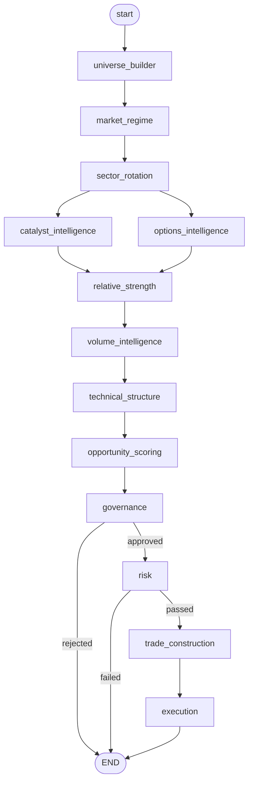
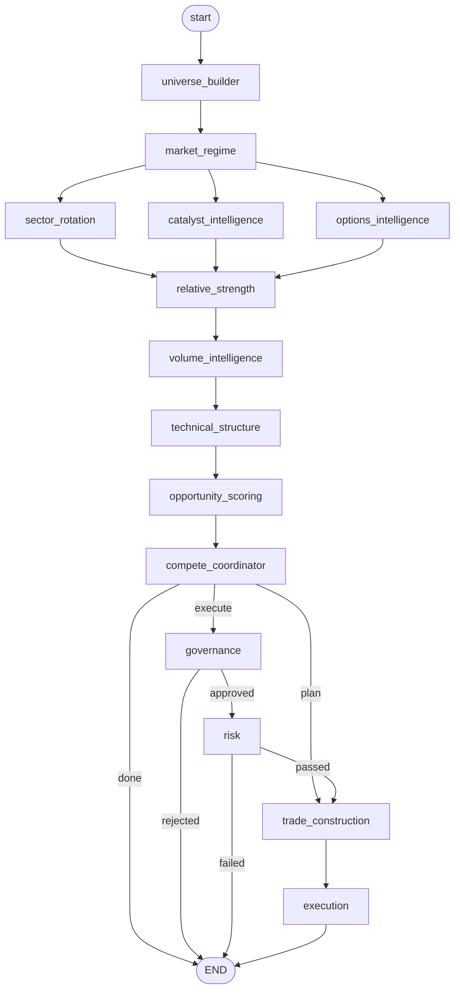
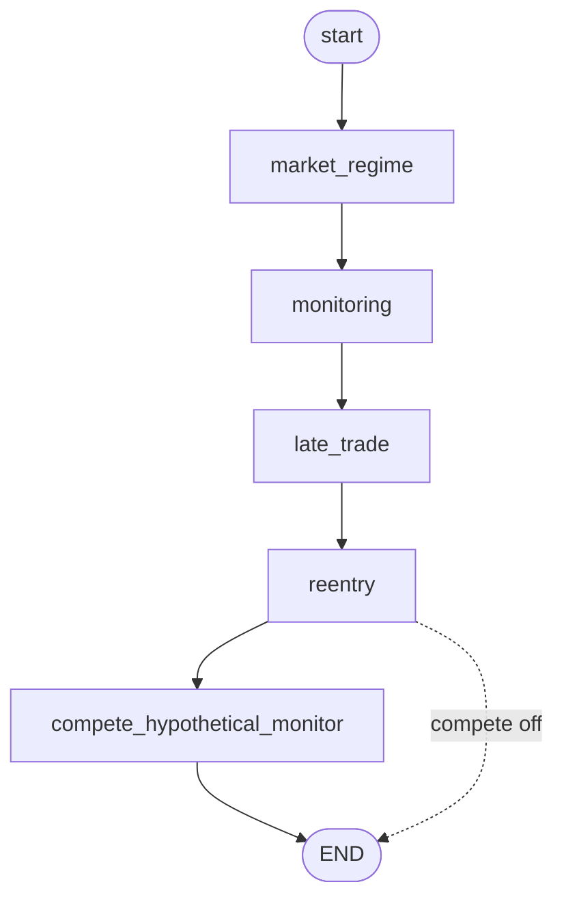
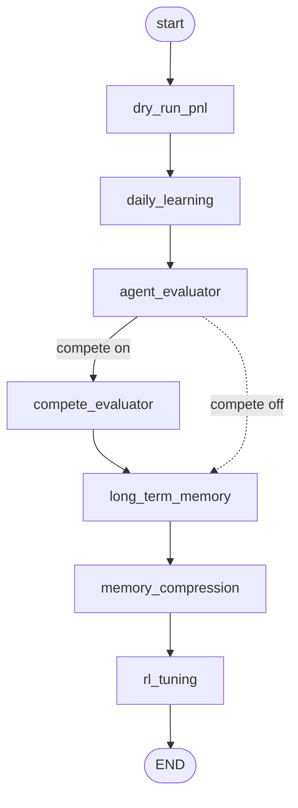

# AutoTrader — Agent Workflow

Four LangGraph graphs run at different times of the trading day. The deterministic
data pipeline (layers 0–3) is shared; layers 4–6 differ by phase.

- **Pre-market** (`scripts/run_pre_market.py`) — ~8:30 AM IST. Builds universe,
  reads regime, scores opportunities, sizes & places (dry-run) entries.
  Uses the **compete** graph when `compete.enabled`, else the plain pre-market graph.
- **Intraday** (`scripts/run_intraday.py`) — loops during market hours. Refreshes
  regime, monitors open positions, late-trades / re-enters.
- **Post-market** (`scripts/run_post_market.py`) — after 15:30 IST. Computes P&L,
  learns, evaluates, tunes parameters.

---

## 1. Pre-market graph (`graphs/pre_market.py`)



## 2. Compete graph (`graphs/compete.py`) — used when compete mode is on

Same data pipeline, but `market_regime` fans out to three branches in parallel,
and `compete_coordinator` runs every provider stack (Anthropic / OpenAI / Google)
through the LLM enrichment before deciding what to do.



- **dry_run: true** → `done` branch: all stacks tracked hypothetically, no real orders.
- **dry_run: false** → `execute`: primary stack's pick goes through governance → risk → execution.

## 3. Intraday graph (`graphs/intraday.py`) — loops during market hours



- **monitoring** — checks each open position against stop / target1 / target2 using
  **real Upstox LTP** (dry-run no longer blind). Books partial at T1, exits at T2/stop.
- **late_trade** — if pre-market placed 0 trades and the regime has since turned
  favorable, executes the waiting opportunities.
- **reentry** — when a position's T1 is hit and capital is freed, deploys it into the
  next-best opportunity.

## 4. Post-market graph (`graphs/post_market.py`)



- **dry_run_pnl** — fetches EOD prices (Upstox), simulates each position's outcome,
  writes the **trade journal**.
- **compete_evaluator** — fetches closing prices, ranks stacks by realized P&L (joint
  ranking on ties).
- **rl_tuning** — Q-learning nudge to `strategy_params.json` (needs ≥3 trades/day).

---

## Agent → tool / data-source map

| Agent | Layer | Key tools / sources |
|---|---|---|
| universe_builder | 0 | `load_config`, universe list |
| market_regime | 1 | `upstox_data.get_nifty_data`, `get_vix`, `get_fii_data`, GIFT gap, `_llm_enrich_regime` |
| sector_rotation | 1 | shared state (sector rankings) |
| catalyst_intelligence | 1 | `_llm_enrich_catalysts` (fast LLM) |
| options_intelligence | 1 | `upstox_data.get_options_chain` (PCR, signal) |
| relative_strength | 2 | `upstox_data.get_historical_candles` |
| volume_intelligence | 2 | shared candle data |
| technical_structure | 2 | `upstox_data.get_historical_candles` (daily + 30-min), ATR/ADX/RSI/VWAP/ORB |
| opportunity_scoring | 3 | `WEIGHTS` composite, `_llm_review_opportunities` |
| compete_coordinator | compete | `make_stack_llms`, re-runs enrich + score per stack |
| governance | 4 | `load_config` (policy gates) |
| risk | 4 | `load_config` (risk limits) |
| trade_construction | 5 | daily ATR, `_adaptive_target_rr` (ADX/vol/RSI) |
| execution | 5 | `get_broker`, `broker.place_order`, `notifier.notify_order` |
| monitoring | 5 | `price_utils.live_ltp` (dry-run) / `broker.get_quote` (live), `broker.place_order` |
| late_trade | 5 | trade_construction + execution |
| reentry | 5 | `upstox_data.get_ltp`, `broker.place_order` |
| dry_run_pnl | 6 | `price_utils.closing_price`, `trade_journal.append_outcomes` |
| daily_learning | 6 | `_llm_generate_insights` |
| agent_evaluator | 6 | per-agent scoring from outcomes |
| compete_evaluator | compete | `price_utils.closing_price`, leaderboard |
| long_term_memory / memory_compression | 6 | memory store |
| rl_tuning | 6 | `strategy_params.json`, `rl_q_table.json` |

---

## Render the live graphs yourself (on OCI)

LangGraph can draw the *actual compiled* graph. Run:

```bash
python3 scripts/render_graphs.py        # writes PNGs + mermaid to reports/graphs/
```
